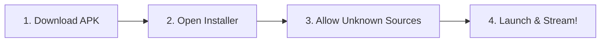

# 🤖 MovX for Android

### *Clean, Ad-Free Movie & TV Streaming on Mobile*

---

---

## ⚡ Highlights

- 🛑 **Integrated Ad-Block Engine**: Block 80,000+ popups and video ads automatically.
- 🔄 **In-App Auto-Updates**: Get latest releases with 1-click install & progress indicator.
- 📱 **Modern UX**: Full notch/camera cutout edge-to-edge support & pull-to-refresh.
- 🎬 **Hardware Accelerated Player**: Fullscreen rotation with zero video stutter.

---

## 📲 Quick Installation Guide

> [!TIP]
> Make sure your device has Android 7.0 or newer.

### Step-by-Step Instructions

1. **Download**: Tap the green **[Direct Download MovX APK]** button above.
2. **Open**: Once the download completes, tap the notification or open the APK from your **Downloads** folder.
3. **Allow Installation**:
   - If prompted with *"For your security, your phone is not allowed to install unknown apps from this source"*:
   - Tap **Settings** ➔ Toggle **"Allow from this source"** ➔ Press **Back**.
4. **Install**: Tap **Install**, then tap **Open** to launch MovX!

---

## ❓ Frequently Asked Questions

<b>🔒 Why does Android show an "Unknown App" or Security warning?</b>

 
MovX is distributed directly via GitHub Releases as an open APK package rather than through Google Play Store. Android displays standard first-install security checks for all non-Play Store software. The app is signed with a verified release key and contains zero telemetry or background tracking.

<b>🔄 How do auto-updates work on Android?</b>

 
MovX includes an automatic background update checker. Whenever a new update is released, a popup will notify you inside the app. Simply tap <b>"Update Now"</b> to download and install the update seamlessly.

<b>📶 What should I do if a stream does not load?</b>

 
Swipe down from the top of the screen to trigger <b>Pull-To-Refresh</b>. If offline, a clean dark retry screen will let you reconnect with a single tap.

---

[← Back to Main Repository](README.md) • [Report an Issue 🐛](https://github.com/Kishanx08/movx/issues)

