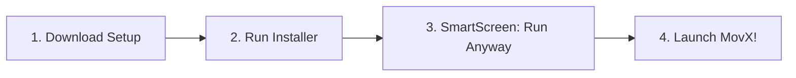

# 🪟 MovX for Windows

### *High Performance Desktop Client for movx.me*

---

---

## ⚡ Highlights

- 🖥️ **Dedicated Windows Frame**: Clean desktop interface without browser clutter or extra tabs.
- 🛑 **Local Ad & Popup Suppression**: Automatically blocks malicious popunder windows and ad scripts.
- 🍿 **Immersive Fullscreen**: Full screen switching with smooth media controls.
- ⚙️ **Lightweight Footprint**: Optimized performance for smooth 1080p / 4K playback.

---

## 💻 Quick Installation Guide

> [!TIP]
> Compatible with Windows 10 & Windows 11 (64-bit systems).

### Step-by-Step Instructions

1. **Download**: Click the blue **[Download MovX Setup.exe]** button above.
2. **Run**: Double-click `MovX-Setup.exe` from your Downloads directory.
3. **SmartScreen Prompt**:
   - If Windows Defender SmartScreen displays *"Windows protected your PC"*:
   - Click **More info** ➔ Click **Run anyway**.
4. **Setup**: Follow the on-screen installer prompts.
5. **Launch**: Open **MovX** directly from your Desktop shortcut or Start Menu!

---

## ❓ Frequently Asked Questions

<b>🛡️ Why does Windows SmartScreen show a prompt during setup?</b>

 
MovX is an open-source client distributed independently via GitHub. Windows SmartScreen displays a initial informational prompt for newly published software without an expensive commercial code-signing certificate. The installer is clean, virus-free, and safe to execute.

<b>🖥️ Can I run MovX on 32-bit Windows?</b>

 
MovX is compiled specifically for 64-bit Windows 10 and 11 to ensure maximum performance and modern codec support.

<b>🐛 How do I submit feedback or report bugs?</b>

 
Please submit issue details, crash logs, or screenshots on our <a href="https://github.com/Kishanx08/movx/issues">GitHub Issues</a> page.

---

[← Back to Main Repository](README.md) • [Report an Issue 🐛](https://github.com/Kishanx08/movx/issues)

